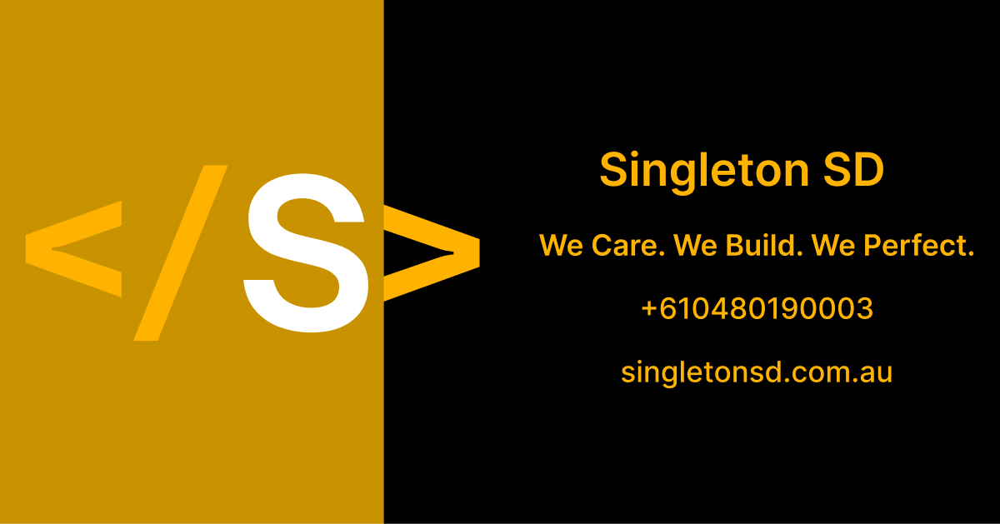
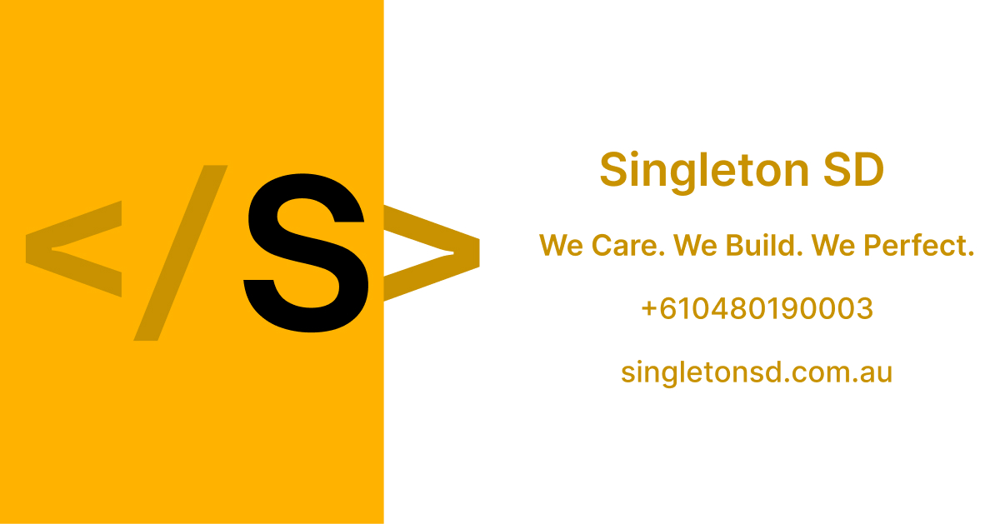

# Singleton SD Assets

Binary brand assets for Singleton SD — icon mark, wordmarks, favicons, PWA
manifests, and Open Graph images.

Served from
[assets.singletonsd.com](https://assets.singletonsd.com)
(GitLab Pages). Token values live in `@singleton-sd/tokens`; Penpot is the
style-guide home. Brand rules: [BRAND.md](./BRAND.md). Agent working
agreements: [AGENTS.md](./AGENTS.md). Token contract:
[FOUNDATIONS.md](https://gitlab.com/singleton-sd/design-system/tokens/-/blob/main/docs/FOUNDATIONS.md)
· [DESIGN.md](https://gitlab.com/singleton-sd/design-system/tokens/-/blob/main/DESIGN.md).

**Brand guide (no Penpot):**
[assets.singletonsd.com/brand/](./brand/) —
open in a browser, or Print → Save as PDF.

## At a glance

| Asset | Preview | Default download |
| ----- | ------- | ---------------- |
| **Dark mark** (512) | [](./logo/static/dark/circle/bg-none/512.png) | [512.png](./logo/static/dark/circle/bg-none/512.png) |
| **Light mark** (512) | [](./logo/static/light/circle/bg-none/512.png) | [512.png](./logo/static/light/circle/bg-none/512.png) |
| **Favicon** | [](./favicons/circle/bg-none/favicon-32x32.png) | [favicon-32x32.png](./favicons/circle/bg-none/favicon-32x32.png) · [site.webmanifest](./favicons/circle/bg-none/site.webmanifest) |
| **OG dark** | [](./og-image/dark/og-default.jpg) | [og-default.jpg](./og-image/dark/og-default.jpg) |
| **OG light** | [](./og-image/light/og-default.jpg) | [og-default.jpg](./og-image/light/og-default.jpg) |
| **Compact wordmark** (dark) | [](./logo/wordmark/compact/dark/bg-none/1280.png) | [1280.png](./logo/wordmark/compact/dark/bg-none/1280.png) |

Use these when you do not need a specific shape, background, or border variant.

## CDN URL convention

Pages serves the `dist/` tree at the site root — omit `/dist` from public URLs.

```text
https://assets.singletonsd.com/logo/static/{dark|light}/{circle|square}/{bg-…}/{size}.png
https://assets.singletonsd.com/logo/wordmark/{legal|descriptor|compact}/{light|dark}/{bg-…}/{width}.png
https://assets.singletonsd.com/logo/wordmark/{legal|descriptor|compact}/{light|dark}/{light|dark}.svg
https://assets.singletonsd.com/favicons/{circle|square}/{bg-…}/…
https://assets.singletonsd.com/og-image/{dark|light}/og-default.jpg
```

Examples:

- `https://assets.singletonsd.com/logo/static/dark/circle/bg-none/512.png`
- `https://assets.singletonsd.com/logo/wordmark/descriptor/light/bg-none/1280.png`
- `https://assets.singletonsd.com/favicons/circle/bg-none/site.webmanifest`

Browse a folder on the CDN for the full size matrix. CI builds cap static mark
PNGs at `<= 512px` and wordmarks at `<= 2560px`; uncapped local builds can emit
`1024` / `4096` (mark) and `4096` (wordmark).

---

## Catalog

### Icon mark

Circular **S** mark. Prefer `circle` / `bg-none` for product UI.

| Variant | Preview |
| ------- | ------- |
| **dark / circle / bg-none** | [](./logo/static/dark/circle/bg-none/512.png) |
| **dark / circle / bg-black** | [](./logo/static/dark/circle/bg-black/512.png) |
| **dark / circle / bd-white** | [](./logo/static/dark/circle/bg-none/bd-white/512.png) |
| **light / circle / bg-none** | [](./logo/static/light/circle/bg-none/512.png) |
| **light / circle / bg-white** | [](./logo/static/light/circle/bg-white/512.png) |
| **light / circle / bd-black** | [](./logo/static/light/circle/bg-none/bd-black/512.png) |

Square cuts use the same path with `square` instead of `circle`. Common sizes:
`320`, `512` (and `1024` / `4096` in uncapped builds).

Variant rules:

- Dark mark: no white fill, no black border
- Light mark: no black fill, no white border

### Wordmarks

Horizontal lockups by role. PNG sizes: `640`, `1280`, `2560` (+ `4096` uncapped).
SVG masters are copied next to each theme folder.

| Role | Wording | Typical use |
| ---- | ------- | ----------- |
| `legal` | `</ SINGLETON >` + Software Pty Ltd | Letters, contracts |
| `descriptor` | `</ SINGLETON >` + Software Development | Web, marketing |
| `compact` | `</ SINGLETON SD >` | Nav, signatures |

| Role / theme | Preview (`bg-none` / 1280) | SVG |
| ------------ | -------------------------- | --- |
| **legal / dark** | [](./logo/wordmark/legal/dark/bg-none/1280.png) | [dark.svg](./logo/wordmark/legal/dark/dark.svg) |
| **legal / light** | [](./logo/wordmark/legal/light/bg-none/1280.png) | [light.svg](./logo/wordmark/legal/light/light.svg) |
| **descriptor / dark** | [](./logo/wordmark/descriptor/dark/bg-none/1280.png) | [dark.svg](./logo/wordmark/descriptor/dark/dark.svg) |
| **descriptor / light** | [](./logo/wordmark/descriptor/light/bg-none/1280.png) | [light.svg](./logo/wordmark/descriptor/light/light.svg) |
| **compact / dark** | [](./logo/wordmark/compact/dark/bg-none/1280.png) | [dark.svg](./logo/wordmark/compact/dark/dark.svg) |
| **compact / light** | [](./logo/wordmark/compact/light/bg-none/1280.png) | [light.svg](./logo/wordmark/compact/light/light.svg) |

Backgrounds:

- Light masters → `bg-gray-light`, `bg-white`, `bg-none`
- Dark masters → `bg-gray`, `bg-black`, `bg-none`

### Favicons and manifests

Generated from the dark mark. Default set: **circle / bg-none**.

#### Circle

| Variant | Preview |
| ------- | ------- |
| **bg-none** | [](./favicons/circle/bg-none/android-chrome-512x512.png) |
| **bg-none / bd-white** | [](./favicons/circle/bg-none/bd-white/android-chrome-512x512.png) |
| **bg-black** | [](./favicons/circle/bg-black/android-chrome-512x512.png) |

#### Square

| Variant | Preview |
| ------- | ------- |
| **bg-none** | [](./favicons/square/bg-none/android-chrome-512x512.png) |
| **bg-none / bd-white** | [](./favicons/square/bg-none/bd-white/android-chrome-512x512.png) |
| **bg-black** | [](./favicons/square/bg-black/android-chrome-512x512.png) |

#### Manifests

| Path | Description |
| ---- | ----------- |
| [circle / bg-none](./favicons/circle/bg-none/site.webmanifest) | Transparent circle |
| [circle / bg-none / bd-white](./favicons/circle/bg-none/bd-white/site.webmanifest) | Transparent circle + white border |
| [circle / bg-black](./favicons/circle/bg-black/site.webmanifest) | Circle on black |
| [square / bg-none](./favicons/square/bg-none/site.webmanifest) | Transparent square |
| [square / bg-none / bd-white](./favicons/square/bg-none/bd-white/site.webmanifest) | Transparent square + white border |
| [square / bg-black](./favicons/square/bg-black/site.webmanifest) | Square on black |

Each favicon folder also includes `favicon-16x16.png`, `favicon-32x32.png`,
`apple-touch-icon.png`, `android-chrome-192x192.png`, `android-chrome-512x512.png`,
`favicon.png`, and `favicon-4096x4096.png`.

Manifest `name` / `short_name`: **Singleton SD** / **SSD**.

### Open Graph

| Variant | Preview |
| ------- | ------- |
| **dark / default** | [](./og-image/dark/og-default.jpg) |
| **light / default** | [](./og-image/light/og-default.jpg) |

Optional retina files: [dark @2](./og-image/dark/og-default@2.png),
[light @2](./og-image/light/og-default@2.png).

### Email and documents (planned)

Signature blocks and letterhead / footer marks will land under `src/email/` and
`src/documents/`. See [BRAND.md](./BRAND.md) for roles and trademark copy.

---

## How to use

### Favicons in HTML (CDN)

```html
<link
  rel="manifest"
  href="https://assets.singletonsd.com/favicons/circle/bg-none/site.webmanifest"
/>
<link
  rel="apple-touch-icon"
  href="https://assets.singletonsd.com/favicons/circle/bg-none/apple-touch-icon.png"
/>
<link
  rel="icon"
  type="image/png"
  sizes="32x32"
  href="https://assets.singletonsd.com/favicons/circle/bg-none/favicon-32x32.png"
/>
<link
  rel="icon"
  type="image/png"
  sizes="16x16"
  href="https://assets.singletonsd.com/favicons/circle/bg-none/favicon-16x16.png"
/>
<link
  rel="shortcut icon"
  href="https://assets.singletonsd.com/favicons/circle/bg-none/favicon.png"
/>
```

### Brand usage (short)

- Do not stretch; keep aspect ratio.
- Clear space ≈ mark height.
- Prefer SVG for web/print vectors; PNG for email and favicon/OG pipelines.
- Full rules: [BRAND.md](./BRAND.md).

---

## Build and contribute

Agent working agreements: [AGENTS.md](./AGENTS.md).

```sh
yarn install
yarn build
```

GitLab npm: `.npmrc` scopes `@singleton-sd` to GitLab’s package registry.
Yarn 1 requires `NPM_TOKEN` (a GitLab PAT locally; CI uses `CI_JOB_TOKEN`).

| Script | Purpose |
| ------ | ------- |
| `yarn build` | Full publish build into `dist/` |
| `yarn build-manifest-icons` | Favicons + `site.webmanifest` |
| `yarn build-static-logo-assets` | Static icon-mark PNGs |
| `yarn build-wordmark-assets` | Wordmark lockup PNGs (+ SVG copy) |
| `yarn generate-html` | README → `dist/index.html` via `@singleton-sd/scripts-readme-to-html` |
| `yarn generate-brand-html` | Brand book → `brand/index.html` |

Size caps:

- CI (`CI=true`): mark static `<= 512`, wordmark static `<= 2560`
- Overrides: `LOGO_STATIC_MAX_SIZE`, `WORDMARK_STATIC_MAX_SIZE`

Contributor workflow: [Logo Asset Workflow](./docs/logo-asset-workflow.md).
Wordmark drop guide: [src/logo/wordmark/README.md](./src/logo/wordmark/README.md).

### Layout

```text
src/
├── logo/
│   ├── config/          # mark: shapes, backgrounds, borders, variants
│   ├── sources/         # dark|light .png / .svg
│   └── wordmark/        # legal / descriptor / compact
│       ├── config/
│       └── sources/{legal,descriptor,compact}/
├── og-image/{dark,light}/
├── email/               # planned signature blocks
└── documents/           # planned letterhead / footer marks

meta.json                # inventory pointers
dist/                    # generated; served by GitLab Pages
├── index.html
├── chrome.css           # catalog chrome from readme-to-html
├── brand/index.html     # public brand-guide snapshot
├── favicons/
├── logo/static/{dark|light}/
├── logo/wordmark/{legal|descriptor|compact}/
├── email/signature/
├── documents/{letterhead,footer}/
└── og-image/
```

## Notes

- Package: `@singleton-sd/assets` (GitLab Releases; npm publish disabled).
- Animations / expression pipelines are intentionally out of scope.

---

© 2026 Singleton SD. All rights reserved.
